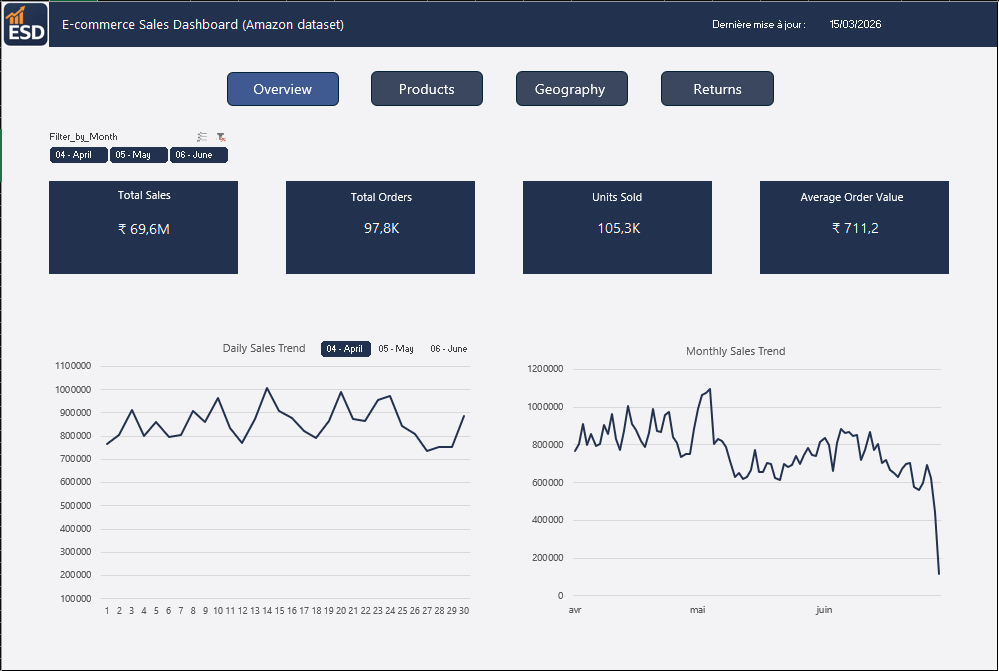

# Amazon Sales Data Analysis & Excel Dashboard

This project explores an Amazon India sales dataset using Python for data preparation and Excel for interactive dashboard creation.

The objective is to simulate a real-world Data Analyst workflow: cleaning raw data, preparing datasets for analysis, and building a dashboard to extract business insights.

## Project Objective

The goal of this project is to analyze Amazon sales data in order to understand:

* overall sales performance
* product category performance
* geographic distribution of sales
* purchasing patterns

The final output of the project is an interactive Excel dashboard allowing users to quickly explore key sales metrics.

## Dataset

Source: Kaggle – Amazon Sales Dataset

The dataset contains more than **100 000 transactions** and includes information such as:

* Order ID
* Order date
* Product category
* Product size
* Quantity sold
* Order amount
* Shipping city and state
* Order status

## Data Preparation (Python)

Data cleaning was performed using **Python and Pandas in a Jupyter Notebook**.

Main preprocessing steps:

* removal of unnecessary columns
* standardization of column names
* cleaning and formatting geographic information (city names)
* handling missing values
* filtering invalid transactions
* formatting numeric fields for analysis

Two datasets were exported after the cleaning process:

* **amazon_clean.csv** → cleaned version of the original dataset
* **amazon_sales.csv** → filtered dataset containing only valid sales transactions

The **amazon_sales dataset** is used as the main source for the dashboard analysis.

## Tools Used

- Python
- Pandas
- Jupyter Notebook
- Excel
- Power Pivot
- Pivot Tables

## Excel Dashboard

An interactive Excel dashboard was created to visualize key sales indicators.

Main KPIs:

* Total Sales
* Total Orders
* Units Sold
* Average Order Value

These KPIs are dynamically calculated using **Power Pivot** and a **Distinct Count on Order ID**.

## Dashboard Analysis

The dashboard provides several perspectives on the data:

### Sales Performance

* Sales by product category
* Top performing states
* Top cities by sales volume

### Customer Behavior

* Product size distribution
* Order quantity analysis

These visualizations allow quick exploration of the dataset and highlight key trends.

## Project Structure

amazon-sales-analysis

- **data/**
    - amazon_clean.csv
    - amazon_sales.csv

- **notebook/**
    - data_cleaning.ipynb

- **dashboard/**
    - amazon_dashboard.xlsx

- **README.md**
    - Project documentation

## Key Insights

Some key patterns observed in the dataset:

- Sales are largely concentrated in a small number of product categories, particularly **Set** and **Kurta**.
- A limited number of Indian states generate the majority of sales.
- Large metropolitan areas dominate the top performing cities.
- Return rates remain relatively low overall but vary depending on product categories and sizes.

The dashboard allows users to explore these patterns interactively across different time periods.

## Dashboard Preview

